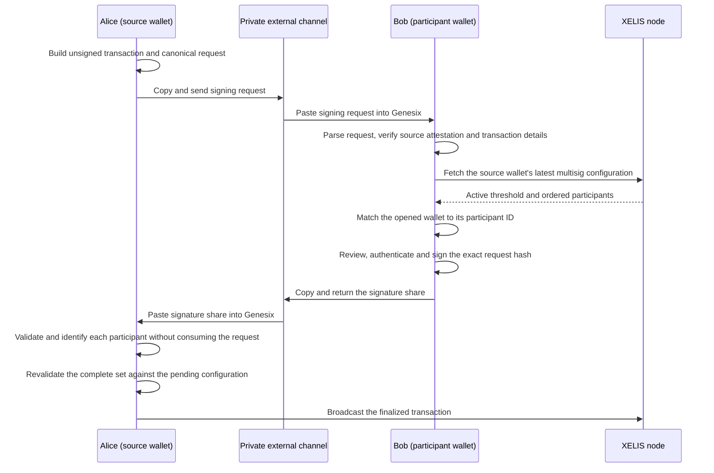

# Multisig signing flow

Genesix exchanges a canonical signing request instead of asking a participant
to sign an isolated transaction hash. This lets the participant review the
transaction and lets Genesix verify that the opened wallet belongs to the
source wallet's active multisig configuration.

## Current flow

The node does not transport requests or signature shares. Alice and Bob
currently exchange both encoded values out of band using copy and paste, for
example through a private messaging channel or a file transferred between
devices.

## Why a node is required by the participant

`xelis_wallet` stores the multisig state of the opened wallet's own address.
Bob's wallet therefore does not locally contain the multisig configuration of
Alice's source address merely because Bob is one of its participants.

The canonical request deliberately does not claim an authoritative participant
configuration. Genesix asks the connected node for Alice's latest active
configuration so it can:

- reject a deleted or invalid configuration;
- display the active threshold and ordered participants;
- determine Bob's participant ID automatically;
- refuse to sign when the opened wallet is not a participant.

This lookup is an additional safety check, not a cryptographic requirement for
creating a signature. It reflects the configuration at inspection or signing
time; consensus remains authoritative when the finalized transaction is
broadcast.

The Flutter interface disables inspection and signing until the wallet is
connected to a node. The Rust wrapper repeats the check and fails closed so the
rule cannot be bypassed through another bridge caller.

## Security properties

Before showing a request as verified, Genesix:

- enforces the expected network and canonical encoding;
- reconstructs the unsigned transaction and its multisig hash;
- verifies the source wallet's attestation;
- verifies the public transaction preview and confidential amount proofs;
- resolves the active multisig configuration from the node;
- binds every returned signature share to the request hash and participant ID.

The source wallet keeps the unsigned transaction and its multisig configuration
in its pending state. Each pasted share can be verified non-destructively so the
interface can display its participant ID. Finalization revalidates the complete
set and rejects a different hash, malformed shares, duplicate participant IDs,
unauthorized keys, and an incorrect signature count without consuming the
pending request.

## Transport and privacy

The request and signature share are integrity-protected, but they are not
confidential transport containers. A signing request can expose wallet
addresses, destinations, amounts, assets, fees, and transaction metadata to
anyone who receives it. Use a private channel and verify the displayed details
before signing.

Copy and paste is the only multisig transport currently implemented. Possible
future transports include:

- an exported file and the platform share sheet;
- a deep link that opens the signing screen and imports a bounded request;
- a static QR code when the encoded value fits;
- a standardized multipart animated QR for larger requests.

Any future import path is untrusted input and must reuse the same canonical
Rust parser, size limits, node verification, explicit review, and biometric
authorization. Raw payloads must never be written to logs or analytics.
